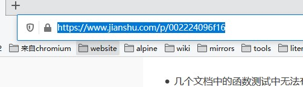

# #### h2md
"h2md"的名字意思是"HTML to Markdown", 它是一款将特定主流网站的网页转为Markdown的实用工具. 

它具有以下优点:

- 便捷的操作.
- 优良的排版.

rsrc -manifest h2md.manifest -ico favicon.ico -o rsrc.syso

go build -o C:\Users\%username%\Desktop\app.exe

go build -ldflags="-H windowsgui" -o C:\Users\%username%\Desktop\app.exe

